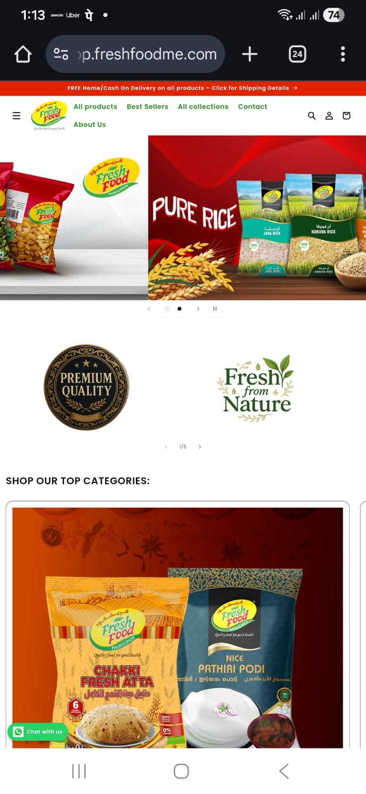
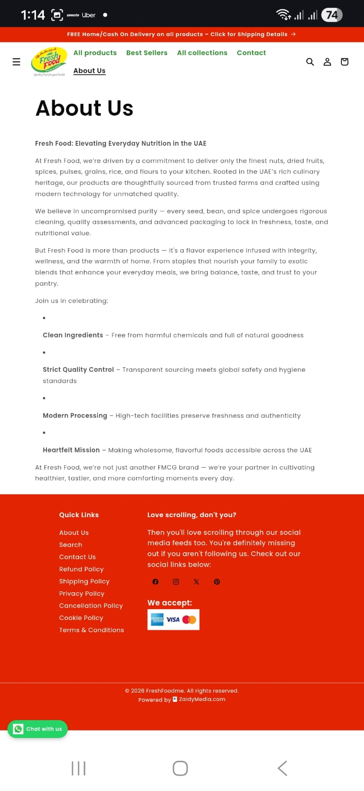

# Shopify E-commerce Projects

This repository showcases real-world Shopify e-commerce websites built for clients.

## Project overview
- Custom Shopify theme customization
- Homepage, collection, and product page layouts
- Conversion-focused UX improvements
- Mobile responsiveness and performance optimization

## Live demo
shop.freshfoodme.com

### Homepage

### About Page

## Tech stack
- Shopify
- Liquid
- HTML / CSS
- JavaScript

## Notes
Due to client confidentiality, full source code is not included.
Screenshots and live links are provided for demonstration purposes.
